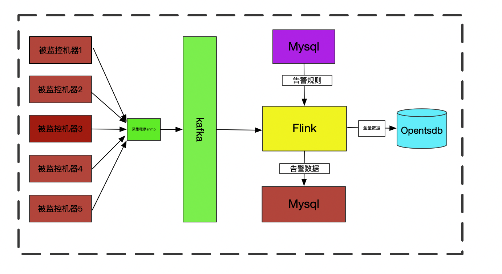

# bigdata-aiops

### 项目概述

​		本项目主要使用flink从kafka接收不同设备的各种指标数据，对其进行相应的处理之后，与阈值进行对比进行准时实告警，并对告警信息做了一些简单的收敛工作，具体见下文.

​		目前数据类型主要包括：Linux/Windows/交换机/dpi设备四种不同的数据类型。下面将分别讲述不同的处理逻辑。

技术架构如下图所示：

###指标库

    1. 指标库文件主要见[./document/V2.0指标库.xml]
    2. 数据库sql文件见[./document/dtc_platform.sql]
    下面各种设备的处理逻辑及计算编码等都是基于以上两个文件进行的
    
#### Linux

​		该设备数据主要采集是机器的各种指标数据，例如Cpu/IO等，通过采集实时对数据进行处理，同时定时从mysql中读取数据告警规则存入内存，与相应的数据进行比较，当超过阈值则将告警数写入mysql供后端进行告警及派单处理。

### Windows

​		该类型同linux类似，但是由于它磁盘是可变的，所以此处需要将磁盘系统写入mysql，之后后端根据表中数据从opentsdb中获取相应的指标数据供前端展示。

### 交换机/Dpi设备
    
   交换机主要包括中兴交换机/华为交换机两种，dpi设备。处理逻辑见文档。

## 告警模块

1. 告警主要使用flink的广播变量的特性，从mysql中读取告警规则，然后与kakfa中的数据进行匹配，当发现值超过阈值时，则触发告警信息。
2. 告警收敛问题

    告警收敛分为四种策略：
    
    a. 当同一台机器的相同指标，在一定的时间范围内触发同一等级的告警信息，合并为一条告警信息；
    
    b. 当同一台机器的相同好指标，在一定时间范围内，递增触发告警等级，合并为最高级别的告警信息；
    
    c. 当设置告警数量时，告警数量成倍数增加，期间的告警数据合并为一条告警信息；
    
    d. 当设置告警周期时，在周期范围内，所有的告警数据合并为一条告警信息；
    
    e. 可以设定某一天/多天的特定时间短内告警信息不告警的功能。
    
    ...

## 本项目主要部分

- 实时处理
- 离线/实时数仓(雏型，进一步完善)

## 本项目使用的技术栈

- Flink
- Opentsdb
- Mysql
- Kafka
- Hive
- Hbase

## 主要架构

- 实时告警/日志处理架构图
  

- 数仓架构图
  

